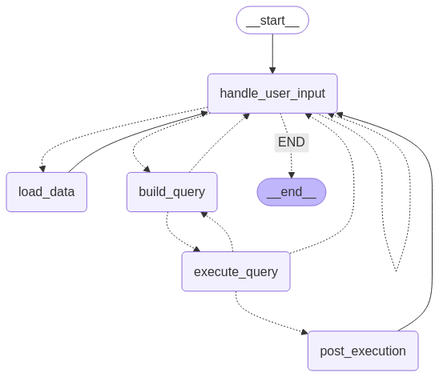

# TableAgentGPT

Welcome to **TableAgentGPT**! This tool allows you to interact with your tabular data by generating queries and retrieving insights on your behalf.



TableAgentGPT automates SQL query processing by handling user input, constructing queries, executing them, and managing post-execution tasks. The workflow follows a structured approach with built-in error handling and user clarification mechanisms.

## How It Works:
1. **User Input Handling (`handle_user_input`)**
   - Processes the user's query and determines the next steps.

2. **Data Loading (`load_data`)**
   - Retrieves the dataframe and its metadata to help the system understand the data better.

3. **Query Construction (`build_query`)**
   - Uses the user input to generate a valid SQL query.

4. **Query Execution (`execute_query`)**
   - Runs the generated SQL query and retrieves results.

5. **Post-Execution Processing (`post_execution`)**
   - If the query execution fails, the system **loops back** to refine the query.
   - If the input is unclear, the system routes back to the user for clarification.


## Getting Started

To begin using TableAgentGPT, you need to load your data along with its metadata after running `TalkWithYourTable.ipynb` notebook. Use the following command format:

```
/load <file_path> <table_columns_description>
```

### Example:
```
/load sample_data/ds_salaries.csv sample_data/ds_salaries_schema.txt
```

Once your data is loaded, you can ask questions about it, and TableAgentGPT will query the data to provide relevant insights.

## Exiting the System
To exit the system, simply type:
```
/q
```


